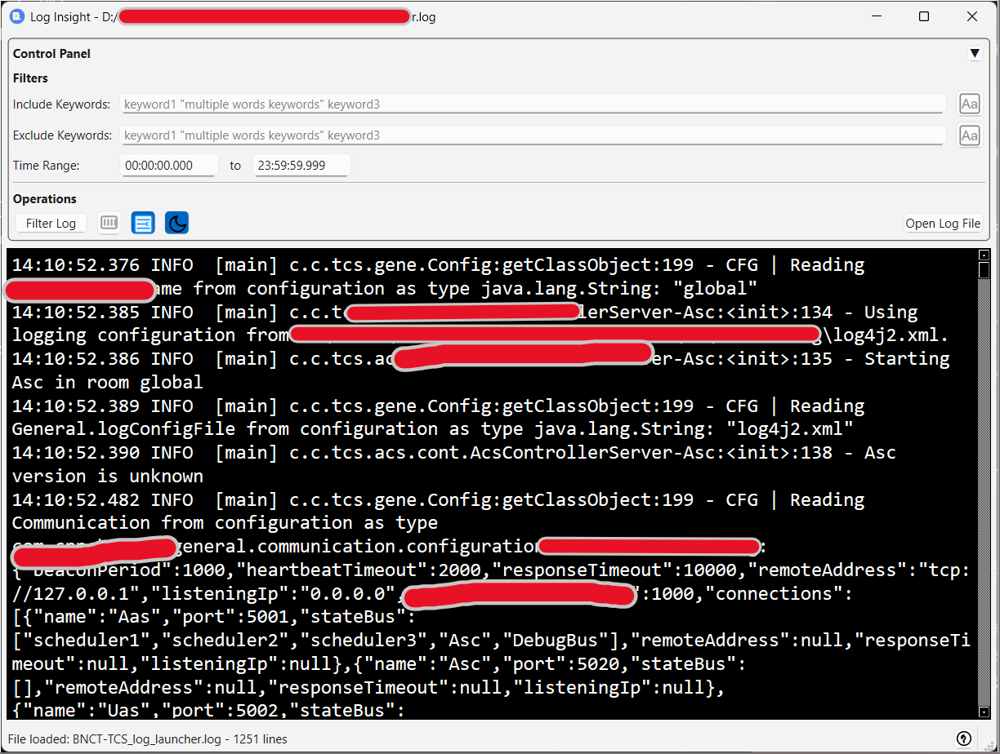

# LogInsight - Log Viewer Tool

This project is a log file viewing tool developed with Python and PyQt. It provides powerful log file viewing, searching, and filtering capabilities to help users quickly locate and analyze log information.





## Technical Specifications
- Uses Python 3.x
- Uses PyQt 6 library for GUI development
- Code implements type hints

## Features
- Open log files
- Search keywords
- Display search results
- Copy search results to clipboard
- Time range filtering (supports format: HH:MM:SS.XXX)
- Include keywords filter (supports multiple keywords, space-separated, keywords with spaces can be enclosed in double quotes)
- Exclude keywords filter (supports multiple keywords, space-separated, keywords with spaces can be enclosed in double quotes)
- Case sensitivity options (Include and exclude keywords each have independent case sensitivity checkboxes)
- Right-click menu support (Copy, Select All, Copy All)
- Remembers last opened file path and options, restores the last opened log file and search conditions when reopening the program
- Font size adjustment (Use Ctrl+mouse wheel to zoom in/out text in the result area)
- In-result area search function (Press Ctrl+F to open search dialog, supports keyword highlighting and navigation)
- Collapse/Expand Control Panel by double-clicking its header


## Usage Instructions

```
python log_insight.py
```

1. Click "File" menu, select "Open Log File"
2. Enter search keywords in the search box
3. Set filter conditions (optional):
   - Include keywords: Log lines must contain at least one include keyword to be displayed
   - Exclude keywords: Log lines containing any exclude keyword will be filtered out (takes precedence over include keywords)
   - Case sensitive: Each keyword textbox has an independent "Case Sensitive" checkbox, when checked, keyword matching will be case sensitive
   - Keywords are separated by spaces, if a keyword contains spaces, enclose it in double quotes, e.g., "error message"
   - Time range: Limit the time range of logs
4. Click "Filter Log" button to execute search
5. View matching log lines in the result area
6. Right-click in the result area to copy selected content or all content
7. Use Ctrl+mouse wheel to zoom in/out text font size in the result area
8. Press Ctrl+F in the result area to open search dialog:
   - Entered keywords will be automatically highlighted
   - Press Enter or click "v" button to jump to next match
   - Press Shift+Enter or click "^" button to jump to previous match
   - Press Esc or click "x" button to close search dialog